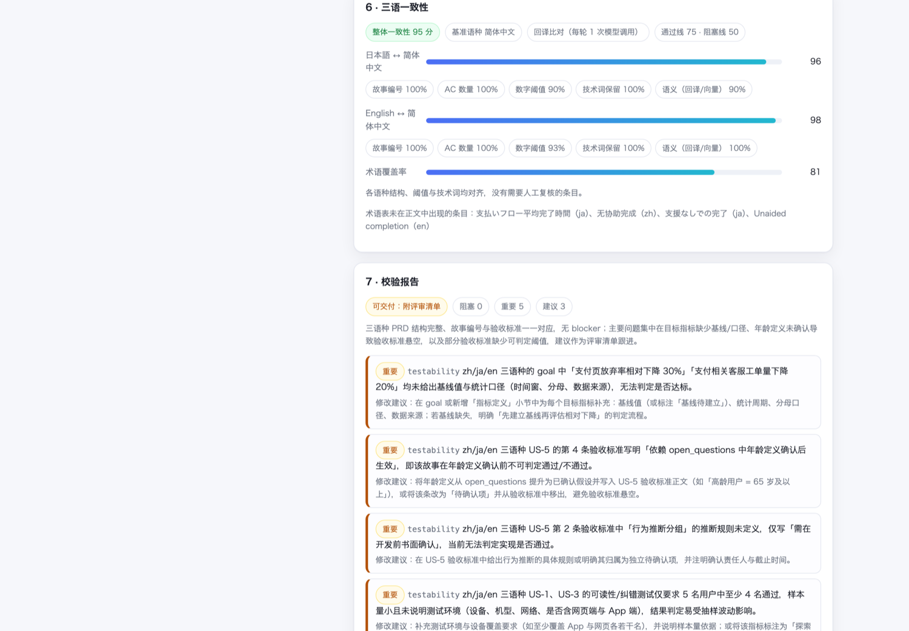

# Spec Agent · Multilingual PRD Generator

> Turn a vague one-liner into an aligned zh / ja / en PRD — before development starts.

[]() []() []() []() [](LICENSE)

[中文](README.md) · [日本語](README.ja.md)

---

## Why this exists

The most expensive loss in cross-border product work happens at **requirement handover**: headquarters writes one vague sentence, the local market team builds their own interpretation, and the mismatch only surfaces at acceptance testing.

**Spec Agent** is a three-stage multi-agent pipeline that turns that sentence into a structured, testable, trilingual PRD:

```
vague requirement → clarification → structured PRD (zh/ja/en) → validation (failures fed back, iterate)
```

It is not a prompt wrapper around "let the LLM write a doc". It does three things upstream projects largely don't:

| Capability | What it does |
| --- | --- |
| 🌐 **Aligned multilingual output** | One input, three PRDs (zh/ja/en) with identical user-story IDs; localized writing, not word-for-word translation |
| 📒 **Glossary** | Key terms in three languages (e.g. 验收标准 / Acceptance Criteria / 受入基準) to stop terminology drift at the source |
| ✅ **Decidable validation semantics** | Deterministic structural checks (missing language, story-count mismatch, missing AC…) + LLM semantic checks (INVEST, testability, cross-language equivalence) |
| 📐 **Consistency score** | A 0–100 score per language pair: story IDs, numeric thresholds, AC counts, technical terms + back-translation or cross-lingual vectors; low-scoring items are ranked for human review |
| 🔁 **Feedback loop with a stop rule** | Failed validation is fed back to the Structurer; if the issue count stops dropping, the loop stops instead of burning tokens |
| 🧭 **Explicit assumptions** | Missing information is never silently invented: completions become "stated assumptions", must-confirm items become Open Questions |
| 🚫 **No placeholders** | Prompts forbid `X%` / `TBD`; metrics need a threshold and a measurement basis, otherwise they become Open Questions |
| 🐳 **Runs with zero config** | No LLM API key? It falls back to a deterministic mock mode, so a fresh clone can walk the whole pipeline |

---

## Example

Input (a realistically vague requirement):

> 日本市场想要一个能让老年用户更容易用的支付流程，现在很多高龄用户走到支付页就放弃了，大概下个季度要上线，最好也能覆盖我们自己的 App 和网页端。

After `python scripts/smoke.py --sample jp-senior-payment` (real `deepseek-chat`, 2 rounds), excerpt of the generated PRD:

```markdown
## Success Metrics
- Reduce the senior-user payment-page abandonment rate by 20% relative to baseline, measured on the payment funnel
  (one full calendar month before vs. after; age from account profile).
- Cut median payment completion time to under 3 minutes (timestamps from payment-page entry to success).

### US-1 · As a senior user in the Japanese market, I want a large-font, high-contrast payment UI so that I can read payment information and pay with less effort.
- AC: Body text ≥ 18pt, plus a size toggle that reaches ≥ 24pt.
- AC: Text/background contrast ≥ 4.5:1 (WCAG 2.1 AA).

## Glossary
| zh | en | ja | note |
| --- | --- | --- | --- |
| 验收标准 | Acceptance Criteria | 受入基準 | Pass/fail must be decidable |
```

Full artifacts, all generated by a real model and not hand-edited:

- [docs/example-output.zh.md](docs/example-output.zh.md)
- [docs/example-output.ja.md](docs/example-output.ja.md)
- [docs/example-output.en.md](docs/example-output.en.md)
- [docs/example-consistency.json](docs/example-consistency.json) — the consistency report from the same run (overall 97.1; zh↔ja 98.6, zh↔en 98.1; no flagged items)

Screenshots: see [docs/screenshots](docs/screenshots).


---

## Architecture

```
              ┌──────────────────────────────────────────────┐
 vague req ──▶│ Clarifier                                    │
              │ goal / users / success metrics / scope       │
              │ assumptions / open questions                 │
              └───────────────────┬──────────────────────────┘
                                  ▼
              ┌──────────────────────────────────────────────┐
              │ Structurer — PRD per target language         │
              │ user stories + testable AC + glossary        │
              └───────────────────┬──────────────────────────┘
                                  ▼
              ┌──────────────────────────────────────────────┐
              │ Validator                                    │
              │ ① deterministic structural checks (free)     │
              │ ② LLM semantic checks (INVEST / testability  │
              │    / cross-language equivalence)             │
              └───────────────────┬──────────────────────────┘
                    blockers?      │
              ┌────────────────────┴──────────────────────────┐
              │ yes → feed issues back to Structurer (≤ N)    │
              │ no  → deliver PRD + review checklist          │
              └──────────────────────────────────────────────┘
```

### Validation semantics (why it never loops forever)

Ask an LLM to review and it will always find something — so Spec Agent splits judgement in two:

| Severity | Meaning | Blocks delivery? |
| --- | --- | --- |
| `blocker` | Undeliverable as-is: an entire language missing, no user stories, stories without ACs, story counts/IDs disagreeing across languages, content invented in one language only | **Yes** — fed back for another round |
| `major` | Hurts understanding or acceptance, but can ship with a checklist: AC without thresholds, oversized stories, placeholder metrics, unlabelled assumptions | No — becomes the review checklist |
| `minor` | Wording, coverage, readability suggestions | No |

Every run returns both the PRD and the review checklist; the loop continues only while the issue count strictly decreases, otherwise it stops early (`stalled = true`) and hands the rest to humans.
Without blockers it iterates at most once more, because extra rounds mostly shuffle wording — and model variance can make a later round worse, so **the best-ranked round is delivered** (no blockers first, then the weighted score).

---

## Trilingual consistency score

"Are the three languages saying the same thing?" is measurable. Every run carries a 0–100 consistency score and lists the items worth human review, ordered by risk.

**Scoring model** (per language pair, weights sum to 100%):

| Signal | Weight | What it checks |
| --- | --- | --- |
| Story ID coverage | 25% | Do the story IDs line up across languages (nothing dropped or invented)? |
| Numeric thresholds | 25% | After aligning the same AC, do the numbers match (18pt vs 24pt, 3 steps vs 4…)? A full conflict inside one AC caps that story below 55 and sends it to review |
| AC count parity | 15% | Same number of acceptance criteria per story |
| Technical terms | 15% | Terms like WCAG 2.1 / AA / TTS / PayPay must survive localization |
| Semantic overlap | 20% | Back-translation or cross-lingual vector similarity against the pivot language |

**Three methods** (`CONSISTENCY_METHOD`):

| Method | Extra cost | Notes |
| --- | --- | --- |
| `structural` (default) | none | Deterministic signals only (IDs / numbers / ACs / terms); fully offline and reproducible |
| `backtranslate` | 1–N model calls per round | Back-translates non-pivot PRDs into the pivot language, then compares wording: **long PRDs are chunked, failed chunks are bisected and retried, and results not actually in the pivot language are discarded** |
| `embeddings` | 1 embedding call per round | Cross-lingual vector similarity instead of back-translation (needs an `/embeddings` endpoint) |

**Thresholds**: overall or per-story score below `CONSISTENCY_BLOCKER_SCORE` (default 50) → blocker (feeds another round); below `CONSISTENCY_MIN_SCORE` (default 75) → major (review checklist); terminology appearing in under 60% of the documents → minor.
**Semantic veto**: if raw similarity against the pivot drops below 0.30, the story is treated as severe drift no matter how tidy the structure looks.

> Thresholds are empirically calibrated on real model outputs: faithful back-translations land at raw Dice 0.50–0.75 (samples in [docs/HANDOVER.md](docs/HANDOVER.md)), so ≥ 0.50 counts as faithful.
> The score is not a proof of semantic equivalence — it **ranks items for human review**, pairing the pivot text with the back-translated text.
> Deterministic signals are the precise ones; the semantic signal is only 20% of the weight.
>
> Sample output: [docs/example-consistency.json](docs/example-consistency.json)



---

## Quick start

### Docker

```bash
git clone https://github.com/shiyuanyeming-hub/spec-agent.git
cd spec-agent
cp backend/.env.example backend/.env      # put LLM_API_KEY here (or leave empty → mock mode)
docker compose up --build
open http://localhost:3000
```

### Local development

```bash
# backend (Python 3.11+)
cd backend
python -m venv .venv && source .venv/bin/activate
pip install -r requirements-dev.txt
cp .env.example .env                      # empty LLM_API_KEY = mock mode
uvicorn app.main:app --reload --port 8000

# frontend (Node 18+)
cd ../frontend
npm install
npm run dev                               # http://localhost:3000, /api/* proxied to :8000
```

CLI:

```bash
cd backend
python scripts/smoke.py --sample jp-senior-payment
python scripts/smoke.py "Batch quarterly report export for the support console" --langs zh,en --out /tmp/prd.md
```

---

## LLM configuration

Works with any OpenAI-style `/chat/completions` endpoint (OpenAI, DeepSeek, Kimi, Ollama, vLLM…).

| Env var | Default | Notes |
| --- | --- | --- |
| `LLM_API_KEY` | empty | **Empty ⇒ deterministic mock mode** (offline, full pipeline still runs) |
| `LLM_BASE_URL` | `https://api.deepseek.com/v1` | OpenAI-compatible base URL |
| `LLM_MODEL` | `deepseek-chat` | Model name |
| `LLM_PROVIDER` | auto | `openai` / `fake`; auto-detected from the presence of a key |
| `LLM_TEMPERATURE` | `0.2` | Sampling temperature |
| `LLM_TIMEOUT_SECONDS` | `120` | Per-request timeout |
| `LLM_MAX_RETRIES` | `3` | Retries with exponential backoff |
| `MAX_VALIDATION_ROUNDS` | `3` | Max validation rounds; without blockers only one extra round runs — **set to 1 for a single round** |
| `CONSISTENCY_METHOD` | `structural` | `structural` / `backtranslate` / `embeddings` / `off` |
| `CONSISTENCY_MIN_SCORE` | `75` | Below this a consistency finding becomes major (review checklist) |
| `CONSISTENCY_BLOCKER_SCORE` | `50` | Below this it becomes a blocker (feeds another round) |
| `BACKTRANSLATE_CHUNK_CHARS` | `4000` | Back-translation chunk size (smaller chunks truncate less) |
| `EMBEDDINGS_BASE_URL` / `EMBEDDINGS_API_KEY` / `EMBEDDINGS_MODEL` | inherit LLM config / `text-embedding-3-small` | Only needed for the `embeddings` method |
| `LLM_MAX_TOKENS` | provider default | Raise it (e.g. `8192`) when outputs get truncated and JSON parsing fails |
| `MAX_INPUT_CHARS` | `4000` | Input length limit |
| `CORS_ORIGINS` | `localhost:3000,...` | Allowed frontend origins |

> A real-model round takes roughly 30–90s (one structuring + one validation call, plus 1–N back-translation calls in `backtranslate` mode).
> The default is ≤ 3 rounds, but **without blockers only one extra round runs**, the loop stops early when issues stop shrinking, and the best-ranked round is delivered.
> For speed set `MAX_VALIDATION_ROUNDS=1`, or keep the default `CONSISTENCY_METHOD=structural` (zero extra cost).

---

## API

### `POST /api/generate`

```bash
curl -s http://localhost:8000/api/generate \
  -H 'Content-Type: application/json' \
  -d '{"raw_text": "Senior-friendly payment flow for the Japanese market", "target_langs": ["zh","ja","en"]}'
```

```jsonc
{
  "prd": { "product_name": "...", "target_langs": ["zh","ja","en"], "docs": { "zh": {...}, "ja": {...}, "en": {...} } },
  "glossary": [{ "term_zh": "...", "term_en": "...", "term_ja": "...", "note": "..." }],
  "markdown": { "zh": "# ...", "ja": "# ...", "en": "# ..." },
  "clarifications": { "goal": "...", "success_metrics": [], "assumptions": [], "open_questions": [] },
  "consistency": {
    "method": "backtranslate",               // structural | backtranslate | embeddings
    "pivot": "zh",
    "overall": 96.4,                         // 0-100
    "terminology_coverage": 0.89,
    "pairs": [{ "lang": "ja", "score": 92.2, "components": { "ids": 1.0, "numeric": 1.0, "entity": 1.0, "semantic": 0.61 } }],
    "divergences": [{ "lang": "en", "story_id": "US-2", "score": 62.0, "reason": "numeric threshold conflict inside one AC: ..." }]
  },
  "validation": {
    "passed": true,
    "status": "needs_review",                 // passed | needs_review | blocked
    "consistency_score": 96.4,
    "counts": { "blocker": 0, "major": 3, "minor": 1 },
    "issues": [{ "severity": "major", "category": "testability", "message": "...", "suggestion": "..." }]
  },
  "rounds_used": 2,
  "status": "needs_review",
  "stalled": true,
  "provider": "openai",
  "trace": [{ "stage": "validator", "status": "needs_review", "round": 2, "detail": "..." }]
}
```

### `POST /api/generate/stream` (SSE)

Emits `stage` events while running, then one `result` event (or `error`).

### Other

| Method | Path | Purpose |
| --- | --- | --- |
| `GET` | `/api/health` | Health + current provider |
| `GET` | `/api/meta` | Config, supported languages, built-in samples |
| `GET` | `/docs` | Interactive FastAPI docs |

---

## Repository layout

```
spec-agent/
├── backend/
│   ├── app/
│   │   ├── agents/           # Clarifier / Structurer / Validator
│   │   ├── checks.py         # deterministic structural checks (the free half of validation)
│   │   ├── llm.py            # OpenAI-compatible client + deterministic mock + tolerant JSON parsing
│   │   ├── pipeline.py       # single orchestration entry: one event stream drives the sync API and SSE
│   │   ├── render.py         # PRD → Markdown
│   │   ├── schemas.py        # Pydantic schemas (also used as JSON-Schema prompts)
│   │   └── samples.py
│   ├── scripts/smoke.py
│   └── tests/                # pytest, 43 tests, mock mode by default
├── frontend/                 # Next.js 14 App Router (live SSE progress, language tabs, glossary, report)
├── docs/                     # handover doc, trilingual sample outputs, screenshots
└── docker-compose.yml
```

## Tests

```bash
cd backend
pytest -q                     # 43 passed, offline, no API spend
ruff check app tests
```

Coverage: LLM JSON tolerance, truncation salvage and retries, mock determinism, structural checks (missing language / story counts / ACs / glossary), validation semantics (blockers block, majors only become a checklist), loop convergence / cap / early stop / one extra round without blockers / best-round delivery, consistency scoring (ID coverage, AC parity, numeric threshold conflicts, technical-term retention, terminology coverage, semantic veto, back-translation language check, chunking and bisect retry, embeddings method), API validation and error codes, SSE event sequence, Markdown rendering.

A ready-to-use CI definition lives in [`docs/ci-workflow.example.yml`](docs/ci-workflow.example.yml) — copy it to `.github/workflows/ci.yml` to enable (runs ruff + pytest + frontend build; everything is mock mode, so no secrets are needed).

## Roadmap

- [x] **v0.1** three-stage pipeline skeleton + PRD template + Docker Compose
- [x] **v0.2** real LLM integration (OpenAI-compatible + mock fallback), trilingual PRDs and glossary, decidable validation semantics with early stop, SSE progress, Next.js UI, real-model sample outputs
- [x] **v0.3** quantified trilingual consistency: deterministic signals (IDs / numeric thresholds / AC counts / technical terms) plus back-translation or cross-lingual vectors; low scores ranked with side-by-side text; chunked back-translation with bisect retry and language validation
- [ ] **v0.4** integration with [VoC Agent](https://github.com/shiyuanyeming-hub/voc-agent): complaint themes → requirement drafts → PRD
- [ ] **v0.5** PRD version diff and Confluence / Notion / Jira export
- [ ] **v0.6** persistent, team-level glossary reused across requirements

## Prior art

- **[MetaGPT](https://github.com/FoundationAgents/MetaGPT)** (MIT, active): `Code = SOP(Team)` with PM/architect/engineer roles — the same "roles + SOP" idea, but Spec Agent keeps orchestration as a testable deterministic event stream for service deployment and feedback loops.
- **[agentic_prd](https://github.com/nanagajui/agentic_prd)** (crewAI): a small, readable PRD generator; its role split is worth borrowing, though it is CLI-only and single-language.

Neither covers what this project targets: **trilingual alignment + glossary + cross-language consistency checks + decidable delivery semantics**.

## Related project

[VoC Agent](https://github.com/shiyuanyeming-hub/voc-agent) answers "what users said" (reviews → pain-point insight); Spec Agent answers "what the team will build" (requirement → standard PRD).

## License

MIT © 2026 shiyuanyeming-hub
