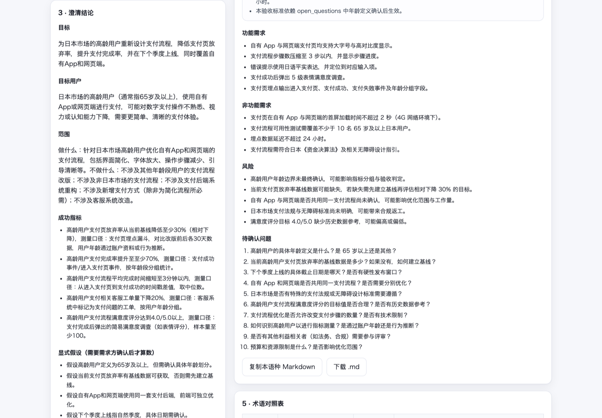

# Spec Agent · 多言語 PRD 生成

> あいまいな要望を、中・日・英で整合した標準 PRD に。
> Turn a vague one-liner into an aligned zh / ja / en PRD.

[]() []() []() []() [](LICENSE)

[中文](README.md) · [English](README.en.md)

---

## これは何か

越境プロダクト開発で最も高くつく損失は**要件の受け渡し**で起こります。本社がひとことの要望を書き、現地チームが独自に解釈して開発し、受け入れ時に食い違いが発覚する——というパターンです。

**Spec Agent** は 3 段階のマルチエージェント・パイプラインで、その一文を「構造化・検証可能・三言語で整合した PRD」に変換します。

```
あいまいな要望 → 要件の明確化 → 言語別 PRD（中/日/英）→ 品質検証（不合格なら差し戻して反復）
```

単なる「LLM に文章を書かせる」ラッパーではありません。上流プロジェクトがほぼ手を付けていない 3 点を担います。

| 機能 | 内容 |
| --- | --- |
| 🌐 **多言語の整合出力** | 1 回の入力で zh/ja/en の PRD を生成。ユーザーストーリー ID は各言語で一致（逐語訳ではなくローカライズ） |
| 📒 **用語対訳表** | 「验收标准 / Acceptance Criteria / 受入基準」などを三言語で対訳し、用語の揺れを根本から防ぐ |
| ✅ **判定可能な検証** | 決定的な構造チェック（言語欠落・ストーリー数不一致・AC 欠落など）＋ LLM による意味チェック（INVEST・テスト可能性・三言語等価性） |
| 🔁 **差し戻しループと停止条件** | 不合格なら Structurer に差し戻し。指摘数が減らなくなったらトークンを焼かずに打ち切る |
| 🧭 **前提の明示** | 情報が足りない部分は勝手に決めない。「明示した前提」と「確認待ち事項」に分離 |
| 🚫 **プレースホルダ禁止** | `X%` / `TBD` / 「未定」をプロンプトで禁止。指標には閾値と測定方法を必須化 |
| 🐳 **ゼロ設定で動作** | API キーが無い場合は決定論的な Mock モードに自動降格し、clone 直後でも全工程が動く |

---

## 出力例

入力（現実によくある粒度の要望）：

> 日本市場想要一个能让老年用户更容易用的支付流程，现在很多高龄用户走到支付页就放弃了，大概下个季度要上线，最好也能覆盖我们自己的 App 和网页端。

`python scripts/smoke.py --sample jp-senior-payment`（実モデル `deepseek-chat`、2 ラウンド）の出力から抜粋：

```markdown
## 成功指標
- 高齢ユーザーの支払いページ離脱率を基準値から 20% 相対削減（計測：支払いファネルの埋め込みデータ、前後 1 か月比較）
- 支払い完了までの中央値を 3 分以内に短縮（計測：支払いページ流入から完了までのタイムスタンプ差）

### US-1 · 日本の高齢ユーザーとして、大きな文字と高いコントラストの支払い画面を使いたい。そうすれば無理なく内容を読んで支払いを完了できる。
- 受入基準：本文の文字サイズは 18pt 以上、拡大切替で 24pt 以上に到達する
- 受入基準：文字と背景のコントラスト比は 4.5:1 以上（WCAG 2.1 AA）

## 用語対訳表
| zh | en | ja | note |
| --- | --- | --- | --- |
| 验收标准 | Acceptance Criteria | 受入基準 | 合否を判定できること |
```

人手を加えず実モデルが生成した完全版はこちら：

- [docs/example-output.zh.md](docs/example-output.zh.md)
- [docs/example-output.ja.md](docs/example-output.ja.md)
- [docs/example-output.en.md](docs/example-output.en.md)

スクリーンショット：[docs/screenshots](docs/screenshots)



---

## アーキテクチャ

```
              ┌──────────────────────────────────────────────┐
 要望（任意言語）│ Clarifier 要件の明確化                        │
 ─────────────▶│ goal / 対象ユーザー / 成功指標 / スコープ        │
              │ 前提 / 確認待ち事項                            │
              └───────────────────┬──────────────────────────┘
                                  ▼
              ┌──────────────────────────────────────────────┐
              │ Structurer 言語別 PRD（zh / ja / en）          │
              │ ユーザーストーリー + 検証可能な AC + 用語対訳表   │
              └───────────────────┬──────────────────────────┘
                                  ▼
              ┌──────────────────────────────────────────────┐
              │ Validator 品質検証                            │
              │ ① 決定的な構造チェック（トークン不要）           │
              │ ② LLM による意味チェック（INVEST / テスト可能性  │
              │    / 三言語の等価性）                          │
              └───────────────────┬──────────────────────────┘
                 blocker あり？    │
              ┌────────────────────┴──────────────────────────┐
              │ あり → Structurer に差し戻し（最大 N ラウンド）   │
              │ なし → PRD とレビュー・チェックリストを納品       │
              └──────────────────────────────────────────────┘
```

### 検証の意味づけ（なぜ永遠に差し戻されないのか）

LLM にレビューさせると必ず何か指摘が出て、永遠に合格しない——これを避けるため判定を 2 層に分けています。

| 重要度 | 意味 | 納品のブロック |
| --- | --- | --- |
| `blocker` | そのままでは開発に入れない：言語の PRD 欠落、ユーザーストーリー無し、AC 無し、言語間でストーリー数/ID が矛盾、特定言語だけ内容が増減 | **する**（次ラウンドへ差し戻し） |
| `major` | 理解や受け入れ判定に影響するが、チェックリスト付きで出せる：AC に閾値が無い、ストーリーが大きすぎる、指標がプレースホルダ、前提が未記載 | しない（レビュー・チェックリストへ） |
| `minor` | 表現・網羅性・可読性の改善提案 | しない |

1 回の実行で「PRD」と「レビュー・チェックリスト」を同時に返し、指摘数が**厳密に減ったときだけ**次ラウンドへ進みます。減らなければ早期停止（`stalled = true`）して残りは人間に委ねます。

---

## クイックスタート

### Docker

```bash
git clone https://github.com/shiyuanyeming-hub/spec-agent.git
cd spec-agent
cp backend/.env.example backend/.env      # LLM_API_KEY を記入（空なら Mock モード）
docker compose up --build
open http://localhost:3000
```

### ローカル開発

```bash
# バックエンド（Python 3.11+）
cd backend
python -m venv .venv && source .venv/bin/activate
pip install -r requirements-dev.txt
cp .env.example .env                      # LLM_API_KEY 空 = Mock モード
uvicorn app.main:app --reload --port 8000

# フロントエンド（Node 18+）
cd ../frontend
npm install
npm run dev                               # http://localhost:3000（/api/* は :8000 にプロキシ）
```

CLI から：

```bash
cd backend
python scripts/smoke.py --sample jp-senior-payment
python scripts/smoke.py "サポート管理画面に四半期レポートの一括出力を追加" --langs zh,ja --out /tmp/prd.md
```

---

## LLM 設定

OpenAI 互換の `/chat/completions` であれば何でも使えます（OpenAI / DeepSeek / Kimi / Ollama / vLLM など）。

| 環境変数 | 既定値 | 説明 |
| --- | --- | --- |
| `LLM_API_KEY` | 空 | **空なら Mock モード**（オフライン・決定論的で全工程が動く） |
| `LLM_BASE_URL` | `https://api.deepseek.com/v1` | OpenAI 互換の base URL |
| `LLM_MODEL` | `deepseek-chat` | モデル名 |
| `LLM_PROVIDER` | 自動 | `openai` / `fake`（キーの有無で自動判定） |
| `LLM_TEMPERATURE` | `0.2` | サンプリング温度 |
| `LLM_TIMEOUT_SECONDS` | `120` | 1 リクエストのタイムアウト |
| `LLM_MAX_RETRIES` | `3` | 指数バックオフ付きリトライ回数 |
| `MAX_VALIDATION_ROUNDS` | `3` | 検証ラウンド上限。**1 にすると実モデルでも 1 ラウンドで終了** |
| `MAX_INPUT_CHARS` | `4000` | 入力長の上限 |
| `CORS_ORIGINS` | `localhost:3000,...` | 許可するフロントエンドのオリジン |

> 実モデルでは 1 ラウンド約 30〜60 秒（構造化 + 検証で各 1 コール）。既定は最大 3 ラウンドで、指摘数が減らなくなれば早期終了します。

---

## API

### `POST /api/generate`

```bash
curl -s http://localhost:8000/api/generate \
  -H 'Content-Type: application/json' \
  -d '{"raw_text": "日本市場向けに高齢者にやさしい支払いフローがほしい", "target_langs": ["zh","ja","en"]}'
```

レスポンス（抜粋）：

```jsonc
{
  "prd": { "product_name": "...", "target_langs": ["zh","ja","en"], "docs": { "zh": {...}, "ja": {...}, "en": {...} } },
  "glossary": [{ "term_zh": "...", "term_en": "...", "term_ja": "...", "note": "..." }],
  "markdown": { "zh": "# ...", "ja": "# ...", "en": "# ..." },
  "clarifications": { "goal": "...", "success_metrics": [], "assumptions": [], "open_questions": [] },
  "validation": {
    "passed": true,
    "status": "needs_review",                 // passed | needs_review | blocked
    "counts": { "blocker": 0, "major": 3, "minor": 1 },
    "issues": [{ "severity": "major", "category": "testability", "message": "...", "suggestion": "..." }]
  },
  "rounds_used": 2,
  "status": "needs_review",
  "stalled": true,
  "provider": "openai",
  "trace": [{ "stage": "validator", "status": "needs_review", "round": 2, "detail": "..." }]
}
```

### `POST /api/generate/stream`（SSE）

実行中は `stage` イベントを逐次配信し、最後に `result`（失敗時は `error`）を 1 回配信します。

### その他

| メソッド | パス | 用途 |
| --- | --- | --- |
| `GET` | `/api/health` | ヘルスチェックと現在のプロバイダ |
| `GET` | `/api/meta` | 設定・対応言語・同梱サンプル |
| `GET` | `/docs` | FastAPI のインタラクティブ API ドキュメント |

---

## ディレクトリ構成

```
spec-agent/
├── backend/
│   ├── app/
│   │   ├── agents/           # Clarifier / Structurer / Validator
│   │   ├── checks.py         # 決定的な構造チェック（検証のうちトークン不要な半分）
│   │   ├── llm.py            # OpenAI 互換クライアント + 決定論的 Mock + 寛容な JSON 解析
│   │   ├── pipeline.py       # 唯一のオーケストレーション入口（同期 API と SSE が同じイベント列を消費）
│   │   ├── render.py         # PRD → Markdown
│   │   ├── schemas.py        # 構造化出力の Pydantic スキーマ（JSON Schema プロンプト兼用）
│   │   └── samples.py
│   ├── scripts/smoke.py
│   └── tests/                # pytest 43 件・既定は Mock モード・オフライン
├── frontend/                 # Next.js 14 App Router（SSE 進捗・言語タブ・用語表・検証レポート）
├── docs/                     # 引き継ぎ資料・三言語の出力例・スクリーンショット
└── docker-compose.yml
```

## テスト

```bash
cd backend
pytest -q                     # 43 passed（オフライン・API 課金なし）
ruff check app tests
```

対象：LLM の JSON 寛容性とリトライ、Mock の決定性、構造チェック（言語欠落・ストーリー数・AC・用語表）、
検証の意味づけ（blocker はブロック、major はチェックリストのみ）、反復の収束・上限・早期停止、
API のバリデーションとエラーコード、SSE イベント順序、Markdown レンダリング。

CI 定義のサンプルは [`docs/ci-workflow.example.yml`](docs/ci-workflow.example.yml)。`.github/workflows/ci.yml` にコピーすれば有効化できます
（ruff + pytest + フロントエンドのビルド。すべて Mock モードなのでシークレット不要）。

## ロードマップ

- [x] **v0.1** 3 段階パイプラインの骨組み + PRD テンプレート + Docker Compose
- [x] **v0.2** 実 LLM 接続（OpenAI 互換 + Mock 降格）、三言語 PRD と用語対訳表、判定可能な検証と早期停止、SSE 進捗、Next.js UI、実モデルによる出力例
- [ ] **v0.3** 三言語整合性の深化：逆翻訳 + 埋め込み類似度によるスコアリング
- [ ] **v0.4** [VoC Agent](https://github.com/shiyuanyeming-hub/voc-agent) 連携：レビューの痛点 → 要件ドラフト → PRD
- [ ] **v0.5** PRD のバージョン diff と Confluence / Notion / Jira へのエクスポート
- [ ] **v0.6** 用語表の永続化（チーム用語集として要件をまたいで再利用）

## 先行事例との関係

- **[MetaGPT](https://github.com/FoundationAgents/MetaGPT)**（MIT・活発）：`Code = SOP(Team)` と PM/アーキテクト/エンジニアの役割分担。Spec Agent は同じ「役割 + SOP」の考え方を採りつつ、オーケストレーションをテスト可能な決定的イベント列として保ちます。
- **[agentic_prd](https://github.com/nanagajui/agentic_prd)**（crewAI）：小規模で読みやすい PRD 生成器。役割分担は参考になりますが、CLI のみ・単一言語です。

どちらも手を付けていないのが本プロジェクトの狙い：**三言語の整合 + 用語対訳 + 言語間整合性チェック + 判定可能な納品基準**。

## 関連プロジェクト

[VoC Agent](https://github.com/shiyuanyeming-hub/voc-agent) は「ユーザーが何を言ったか」（レビュー → 痛点）を、Spec Agent は「チームが何を作るか」（要件 → 標準 PRD）を担います。

## License

MIT © 2026 shiyuanyeming-hub
